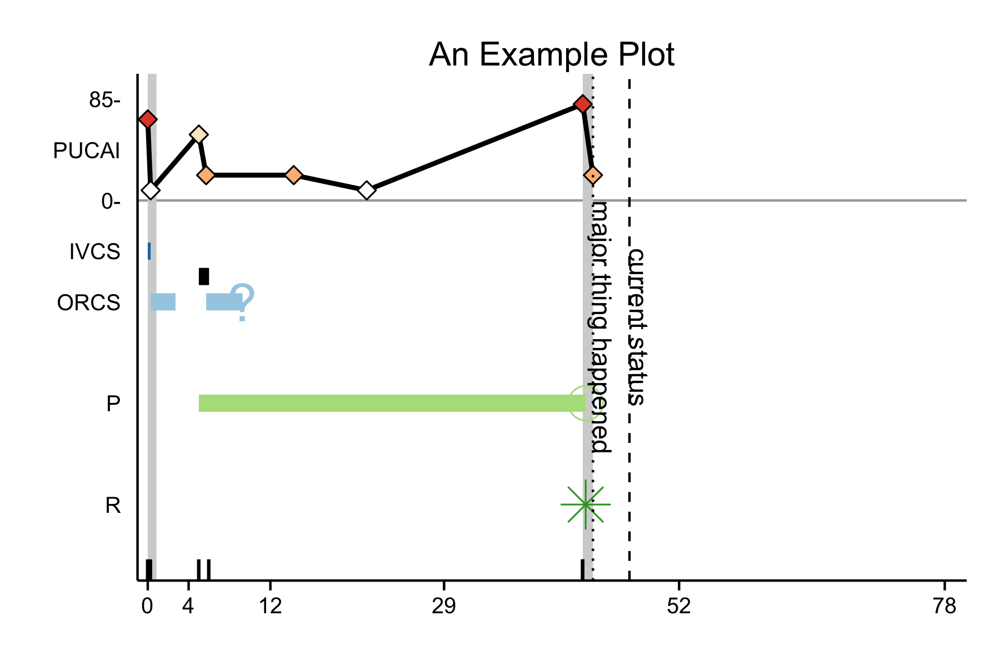

# Make Graphical Patients Profile in R

`patientProfileR` is an R package that simplifies making graphical patient profiles. This package uses the powerful [ggplot2](https://github.com/hadley/ggplot2) package to create patient profiles in a couple of steps. Users can easily extend the plots using [ggplot2](https://github.com/hadley/ggplot2). 

## Geom Mappings

`patientProfileR` makes the data do most of the work. The program plots each row of a subject's data in a particular way. Specifically, the dataset must contain the 

| geom    | x   | xend | y  | color | group | shape | fill | size | alpha | linetype |
|:--------|-----|------|----|-------|-------|-------|------|------|-------|----------|
| 'segment' |1 per row   |&#10004;|&#10004;|&#10004;|&#10004;|    |&#10004;|&#10004;|&#10004; | | |
| 'line'    |&#10004;| |&#10004;|&#10004;|&#10004;|&#10004;|&#10004;|&#10004; | &#10004;| |
| 'area'    |&#10004;|&#10004;| |&#10004;| | || | &#10004;| |
| 'vline'   |&#10004;| | |&#10004;| | || | |&#10004; |